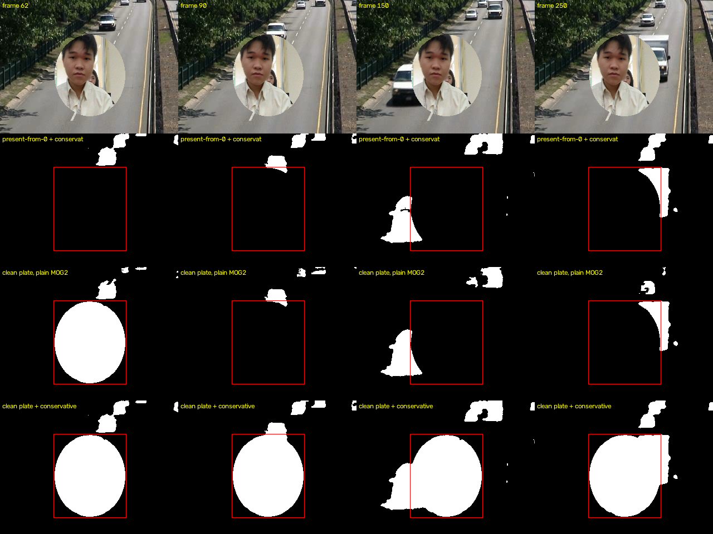
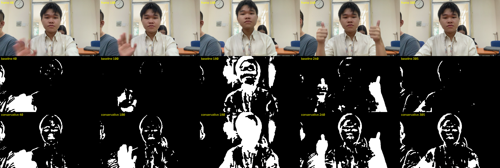

# The stationary subject, and what actually fixes it

MOG2 detects **motion**, not people. On CDnet `highway` that distinction never
comes up — cars are always moving — and the model scores F1 0.9338. On a webcam
clip of somebody sitting at a desk it is the whole story: the subject is folded
into the background within a second or two and the mask goes empty.

This is not a tuning problem, and it is not a post-processing problem. Post
-processing refines a mask; it cannot put back a person the mask no longer
contains.

## The two mechanisms, separated

Zivkovic's MOG2 updates **every** pixel every frame. A subject who holds still
therefore teaches the background model that they *are* the background. ViBe
(Barnich & Van Droogenbroeck, 2011) answers this with a **conservative update**:
a pixel only feeds the model if it was classified *background*. That is the
`conservative=True` option on every model here — `alpha = 0` and `prune = 0`
wherever the previous frame said foreground, so the Gaussians at that pixel are
frozen entirely.

But protection only protects what was **detected**. A subject who was already
sitting in front of the camera when the program started is inside mode 0 before
anything runs, is never classified foreground, and so is never protected. For
that, the model has to see the room empty first — a **clean plate**.

Both are necessary. Neither is sufficient.

## Measurement

Composite sequence, exact ground truth: real `highway` frames as the background
(static camera, real sensor noise), a real crop of the person from
`LTSSUD-Test.mp4` pasted through an ellipse, with per-frame Gaussian noise at
2.5 grey levels on the paste. The subject enters at frame 60 and then never
moves again. 200 scored frames; IoU is measured on the subject only, because
the highway cars are genuine moving foreground and detecting them is correct.

Reproduce with `python docs/experiment_cleanplate.py`.

| configuration                  |   IoU |  first 20 frames | last 100 frames | frames lost (IoU<0.2) |
| ------------------------------ | ----: | ---------------: | --------------: | --------------------: |
| present from frame 0, plain    | 0.000 |            0.000 |           0.000 |               200/200 |
| present from frame 0, conserv. | 0.000 |            0.000 |           0.000 |               200/200 |
| clean plate, plain MOG2        | 0.070 |            0.696 |           0.000 |               186/200 |
| **clean plate + conservative** | **0.972** |        **0.991** |       **0.961** |             **0/200** |

Row 2 is the `LTSSUD-Test.mp4` situation: the subject box is empty at every
frame. Row 3 shows plain MOG2 detecting the subject cleanly on entry (frame 62)
and losing it by frame 90 — absorbed in about one second. Row 4 holds it for
the full 190 frames.

## Cost on the moving-object case

Conservative update is not free. CDnet `highway`, frames 470-1700, YCrCb,
through `mask_refiner`:

| | F1 | IoU | P | R |
| --- | ---: | ---: | ---: | ---: |
| conservative off | 0.9338 | 0.8758 | 0.9873 | 0.8858 |
| conservative on  | 0.9283 | 0.8661 | 0.8816 | 0.9801 |

It costs 0.6 F1 there: a car's trailing edge stays protected slightly longer
than the ground truth says it should, so recall rises to 0.98 and precision
falls. That is the correct trade for a webcam and the wrong one for traffic,
which is why the option is **off by default** — `settings.MOG2_CONSERVATIVE_UPDATE`
— and turned on only by `main.py`. With it off the models remain bit-exact
against `cv2.BackgroundSubtractorMOG2`, which is what `tests/` asserts.

## What it does *not* fix

On `LTSSUD-Test.mp4` itself — subject present from frame 0, no clean plate
available — conservative update roughly doubles coverage and cuts the frames
where the subject has vanished from 137 to 35 out of 310:

| configuration | coverage | <5% | >60% | blobs |
| --- | ---: | ---: | ---: | ---: |
| plain, alpha ramp | 8.9% | 137 | 1 | 36.6 |
| plain, alpha 0.002 | 12.9% | 60 | 1 | 52.8 |
| conservative, alpha ramp | 18.1% | 35 | 1 | 57.3 |
| conservative, alpha 0.002 | 20.6% | 21 | 1 | 48.4 |

but look at what those extra pixels are:

It is an **outline**, not a silhouette. Small head movements reveal the edges
of the face, those get protected and stay; the interior of a cheek or a shirt
never changes appearance when it shifts a few pixels, so it is never detected,
never protected, and stays in the background model where frame 0 put it.

A large morphological CLOSE (21x21 at 480x270) does seal the outline into a
convincing filled silhouette. It is still the wrong fix: the same operation
costs precision 0.90 -> 0.81 on `highway` and empties the mask entirely on 6
frames there. Needing it is a symptom that the seed is wrong, not evidence that
morphology is right.

## Practical consequence

`main.py --clean-plate 48` trains on the first 48 frames (2 s at 24 fps) before
showing anything; step out of shot while it does. There is nothing special
about those frames inside the model — they are ordinary steps that happen to
see an empty room, so mode 0 ends up holding the real background. Conservative
update, on by default in `main.py`, is what then keeps it intact.

Without a clean plate the problem is underdetermined, and it is worth saying so
plainly rather than staging a demo where the subject has to keep waving: a
stationary person is statistically indistinguishable from persistent background
under the MOG2 observation model. Recovering them needs either an empty-scene
observation or a semantic prior. Neither is a defect in the implementation.

## References

- Barnich, O. & Van Droogenbroeck, M. (2011). *ViBe: A Universal Background
  Subtraction Algorithm for Video Sequences.* IEEE TIP 20(6). — conservative
  update, and the random spatial propagation that this implementation leaves out.
- Zivkovic, Z. (2004). *Improved Adaptive Gaussian Mixture Model for Background
  Subtraction.* ICPR. — the model being modified.
- Braham, M., Piérard, S. & Van Droogenbroeck, M. (2017). *Semantic Background
  Subtraction.* ICIP. — the other way out: a semantic mask gating the update.
